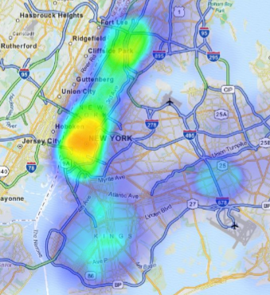

# Public Traffic

## About

Using public data about congestion and traffic in New York City, this program attempts to give directions based on traffic densities at given times. A congestion map and geolocation map were constructed seperately and can be used in finding directions.

## Example Run

### Data Into

The two main types of data were traffic densities overtime on roadways and the geolocation of each intersection. Since the goal of this project was to only use public and free data, many details were left out and had to be interpolated. Intersections were determined from matching patterns between concurrent street intersections. With these intersections identified the geolocations can be applied.

The following code goes over the data used.


```python
import pandas as pd

congestion_path = 'https://data.cityofnewyork.us/resource/ry4b-kref.json'
congestion_data = pd.read_json(congestion_path)
congestion_data.describe()

```


<div>
<table border="1" class="dataframe">
  <thead>
    <tr style="text-align: right;">
      <th></th>
      <th>_10_00_11_00am</th>
      <th>_10_00_11_00pm</th>
      <th>_11_00_12_00am</th>
      <th>_11_00_12_00pm</th>
      <th>_12_00_1_00_am</th>
      <th>_12_00_1_00pm</th>
      <th>_1_00_2_00am</th>
      <th>_1_00_2_00pm</th>
      <th>_2_00_3_00am</th>
      <th>_2_00_3_00pm</th>
      <th>...</th>
      <th>_6_00_7_00am</th>
      <th>_6_00_7_00pm</th>
      <th>_7_00_8_00am</th>
      <th>_7_00_8_00pm</th>
      <th>_8_00_9_00am</th>
      <th>_8_00_9_00pm</th>
      <th>_9_00_10_00am</th>
      <th>_9_00_10_00pm</th>
      <th>id</th>
      <th>segment_id</th>
    </tr>
  </thead>
  <tbody>
    <tr>
      <th>count</th>
      <td>5945.00000</td>
      <td>5945.000000</td>
      <td>5945.000000</td>
      <td>5945.000000</td>
      <td>5945.000000</td>
      <td>5945.000000</td>
      <td>5945.000000</td>
      <td>5945.000000</td>
      <td>5945.000000</td>
      <td>5945.000000</td>
      <td>...</td>
      <td>5945.000000</td>
      <td>5945.000000</td>
      <td>5945.000000</td>
      <td>5945.000000</td>
      <td>5945.000000</td>
      <td>5945.000000</td>
      <td>5945.000000</td>
      <td>5945.000000</td>
      <td>5945.000000</td>
      <td>5945.000000</td>
    </tr>
    <tr>
      <th>mean</th>
      <td>487.28545</td>
      <td>362.049790</td>
      <td>318.573759</td>
      <td>500.595795</td>
      <td>268.121110</td>
      <td>518.770227</td>
      <td>199.495542</td>
      <td>533.232464</td>
      <td>158.692710</td>
      <td>567.876198</td>
      <td>...</td>
      <td>298.851135</td>
      <td>578.716232</td>
      <td>449.667142</td>
      <td>521.869638</td>
      <td>516.786123</td>
      <td>459.429268</td>
      <td>495.612616</td>
      <td>403.548360</td>
      <td>194.338099</td>
      <td>72266.300757</td>
    </tr>
    <tr>
      <th>std</th>
      <td>543.55638</td>
      <td>488.597643</td>
      <td>455.668074</td>
      <td>542.300931</td>
      <td>397.695541</td>
      <td>559.326384</td>
      <td>321.381335</td>
      <td>571.878622</td>
      <td>283.657075</td>
      <td>608.448369</td>
      <td>...</td>
      <td>496.852700</td>
      <td>632.129919</td>
      <td>615.741179</td>
      <td>597.114398</td>
      <td>618.118818</td>
      <td>549.351007</td>
      <td>569.209612</td>
      <td>510.630172</td>
      <td>112.834724</td>
      <td>52561.851711</td>
    </tr>
    <tr>
      <th>min</th>
      <td>0.00000</td>
      <td>0.000000</td>
      <td>0.000000</td>
      <td>0.000000</td>
      <td>0.000000</td>
      <td>0.000000</td>
      <td>0.000000</td>
      <td>0.000000</td>
      <td>0.000000</td>
      <td>0.000000</td>
      <td>...</td>
      <td>0.000000</td>
      <td>0.000000</td>
      <td>0.000000</td>
      <td>0.000000</td>
      <td>0.000000</td>
      <td>0.000000</td>
      <td>0.000000</td>
      <td>0.000000</td>
      <td>1.000000</td>
      <td>2153.000000</td>
    </tr>
    <tr>
      <th>25%</th>
      <td>195.00000</td>
      <td>110.000000</td>
      <td>87.000000</td>
      <td>208.000000</td>
      <td>64.000000</td>
      <td>219.000000</td>
      <td>41.000000</td>
      <td>228.000000</td>
      <td>28.000000</td>
      <td>247.000000</td>
      <td>...</td>
      <td>71.000000</td>
      <td>234.000000</td>
      <td>123.000000</td>
      <td>197.000000</td>
      <td>170.000000</td>
      <td>164.000000</td>
      <td>184.000000</td>
      <td>134.000000</td>
      <td>87.000000</td>
      <td>28934.000000</td>
    </tr>
    <tr>
      <th>50%</th>
      <td>323.00000</td>
      <td>202.000000</td>
      <td>170.000000</td>
      <td>337.000000</td>
      <td>136.000000</td>
      <td>353.000000</td>
      <td>92.000000</td>
      <td>366.000000</td>
      <td>66.000000</td>
      <td>395.000000</td>
      <td>...</td>
      <td>148.000000</td>
      <td>391.000000</td>
      <td>264.000000</td>
      <td>339.000000</td>
      <td>340.000000</td>
      <td>289.000000</td>
      <td>326.000000</td>
      <td>238.000000</td>
      <td>209.000000</td>
      <td>51933.000000</td>
    </tr>
    <tr>
      <th>75%</th>
      <td>579.00000</td>
      <td>394.000000</td>
      <td>335.000000</td>
      <td>598.000000</td>
      <td>277.000000</td>
      <td>621.000000</td>
      <td>207.000000</td>
      <td>645.000000</td>
      <td>161.000000</td>
      <td>691.000000</td>
      <td>...</td>
      <td>319.000000</td>
      <td>702.000000</td>
      <td>530.000000</td>
      <td>620.000000</td>
      <td>627.000000</td>
      <td>533.000000</td>
      <td>584.000000</td>
      <td>454.000000</td>
      <td>292.000000</td>
      <td>110445.000000</td>
    </tr>
    <tr>
      <th>max</th>
      <td>5577.00000</td>
      <td>4468.000000</td>
      <td>4815.000000</td>
      <td>5592.000000</td>
      <td>4463.000000</td>
      <td>5766.000000</td>
      <td>4489.000000</td>
      <td>5247.000000</td>
      <td>4818.000000</td>
      <td>6171.000000</td>
      <td>...</td>
      <td>5166.000000</td>
      <td>5810.000000</td>
      <td>9226.330000</td>
      <td>5249.000000</td>
      <td>7302.000000</td>
      <td>5102.000000</td>
      <td>5788.000000</td>
      <td>4986.000000</td>
      <td>377.000000</td>
      <td>192292.000000</td>
    </tr>
  </tbody>
</table>
<p>8 rows × 26 columns</p>
</div>





```python
geo_path = 'geolocations.json'
geo_data = pd.read_json(geo_path)
print geo_data.top()
```


    ----------------------------------------------------------------------

    AttributeError                       Traceback (most recent call last)

    <ipython-input-14-0a093e0514a2> in <module>()
          1 geo_path = 'geolocations.json'
          2 geo_data = pd.read_json(geo_path)
    ----> 3 print geo_data.top()
    

    /usr/local/lib/python2.7/dist-packages/pandas/core/generic.pyc in __getattr__(self, name)
       2667             if name in self._info_axis:
       2668                 return self[name]
    -> 2669             return object.__getattribute__(self, name)
       2670 
       2671     def __setattr__(self, name, value):


    AttributeError: 'DataFrame' object has no attribute 'top'


### Running the example

In order to use the program, just set your destination and starting location, setup the traveller and run.

An important note: within the nycdrive file are booleans specific for using the congestion map and the geolocation map. Altering these will change directions given.


```python
from nycdrive import *

inter1 = ['STAFFORD AVE', 'HUGUENOT AVE']
inter2 = ['AVE T', 'CONEY ISLAND AVE']

inter_node1 = nyc_map.get_intersection_node(inter1)
inter_node2 = nyc_map.get_intersection_node(inter2)

max_nodes = len(nyc_map.nodes)

car = Traveller(inter_node1, inter_node2, 'NA')
car.dfs_travel()
```

Now we can print the route.


```python
catch_path = []
if True:
    for i in range(max_nodes):
        for n in range(max_nodes):
            if i == n:
                continue
            node_i = nyc_map.nodes[i]
            node_n = nyc_map.nodes[n]
            car = Traveller(node_i, node_n, '_9_00_10_00pm')
            if geolocation_map and not congestion_map:
                car.greedy_travel()
            else:
                car.dfs_travel()
            if len(car.path) > 7:# printed:
                printed = True
                catch_path = car.path

for pth in catch_path:
    fspk1, fspk2 = pth.spks
    sname1 = nyc_map.get_street_name(fspk1)
    sname2 = nyc_map.get_street_name(fspk2)
    print (sname1, sname2)
```

The output is a list of intersections that are visited from start to destination.


## Concept

The idea behind this project was to see how well a public and free database could do in comparison with production quality data. Although additional details could be fleshed out through processing the data even more, overall the data does not provide enough information to construct a working directional map of NYC. Certain attributes of streets such as one-way directions were eliminated to see if the results improved, but there was little improvement.

## Contribute

Feel free to use this code for your personal amusement or even add to it. Contact me with any questions you might have.
